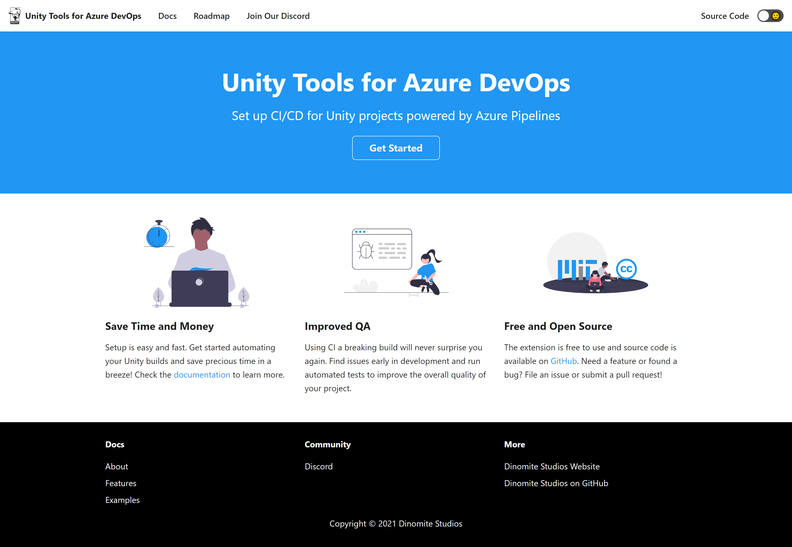

# Unity Tools for Azure DevOps

This extension adds CI/CD tooling for use in Azure Pipelines on Azure DevOps when working with [Unity](https://www.unity3d.com) projects.

# Get Started

Documentation for the extension can be found at [www.unitydevops.com](https://www.unitydevops.com).

## Branches

| Branch      | Description                                                                                                                                                                        | Status                                                                                                                                                     |
| ----------- | ---------------------------------------------------------------------------------------------------------------------------------------------------------------------------------- | ---------------------------------------------------------------------------------------------------------------------------------------------------------- |
| main        | The main branch is build and deployed to the [Visual Studio Marketplace](https://marketplace.visualstudio.com/items?itemName=DinomiteStudios.64e90d50-a9c0-11e8-a356-d3eab7857116) |         |

## Contributions

Found and fixed a bug or improved on something? Contributions are welcome! Please target your pull request against the `main` branch or file an issue on [GitHub](https://github.com/Dinomite-Studios/unity-azure-pipelines-tasks/issues) so someone else can try and implement or fix it. You are also welcome to join our [Discord](https://discord.gg/RpHSpxkEP6) for help and discussions.
