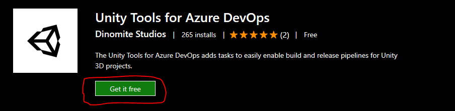

This Azure DevOps extension contains build and release tasks for use in Azure Pipelines to implement continuous intergration and delivery with Unity 3D projects. This documentation will guide you on how to setup your pipeilnes and get started using the extension.

## 1. Installing the extension
Please install the extension ["Unity Tools for Azure DevOps"](https://marketplace.visualstudio.com/items?itemName=DinomiteStudios.64e90d50-a9c0-11e8-a356-d3eab7857116) for use in your Azure DevOps organization.

Now that you have installed the extension, you can use the following tasks in your pipelines:

* [Unity Get Project Version](unity-get-project-version.md)
* [Unity Activate License](unity-activate-license.md)
* [Unity Build](unity-build.md)

## 2. Supported Build Agents
The extension supports Microsoft hosted agents as well as custom agents. Some of Unity's target build platforms are not supported on hosted agents, since they require manual configuration of SDKs & Tools, which we can't do on hosted agents. For full control over the tools and software, we recommend using your own build agent. This table illustrates the supported platforms on either agent:

| Target Platform            |                             Hosted Agents                            |    Custom Agents   |
|----------------------------|:--------------------------------------------------------------------:|:------------------:|
| PC & Mac Standalone        |                          :heavy_check_mark:                          | :heavy_check_mark: |
| Android                    | :x: Android requires SDK / NDK paths to be set in editor preferences | :heavy_check_mark: |
| iOS                        | :heavy_check_mark:                                                   | :heavy_check_mark: |
| tvOS                       | :heavy_check_mark:                                                   | :heavy_check_mark: |
| Universal Windows Platform | :heavy_check_mark:                                                   | :heavy_check_mark: |
| WebGL                      | :heavy_check_mark:                                                   | :heavy_check_mark: |

**Please note that a Unity Plus / Pro seat with at least one available activation is required to build using hosted agents. This is a requirement by Unity not this extension**

### 2.1 Configuring a custom agent
Setting up your own agent is a one time operation and quite easy to do. We've prepared setup guides to help you get started. For a full documentation on how to setup build agents, please refer to the official documentation by Microsoft.

* [Setup Windows Agent](setup-windows-agent.md)
* [Setup macOS Agent](setup-mac-os-agent.md)

## 3. Define build pipelines
Feel free to use one of these guides to get you started building for your desired platform. Keep in mind every project has different requirements and your pipeline might require additional steps. Depending on the type of your agent, choose one of the following guides:

* [Build using custom agent](custom-agent.md)
* [Build using hosted agent](hosted-agent.md)
