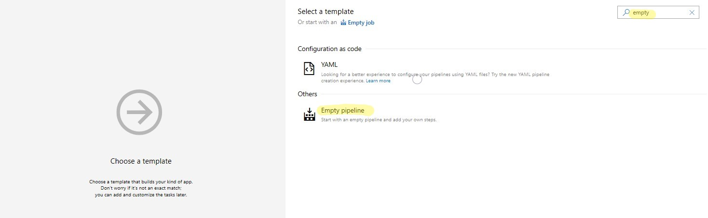
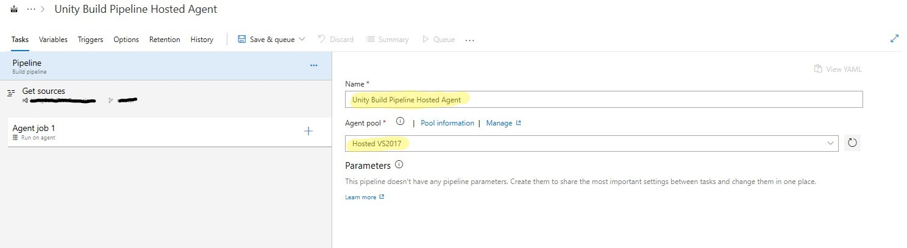
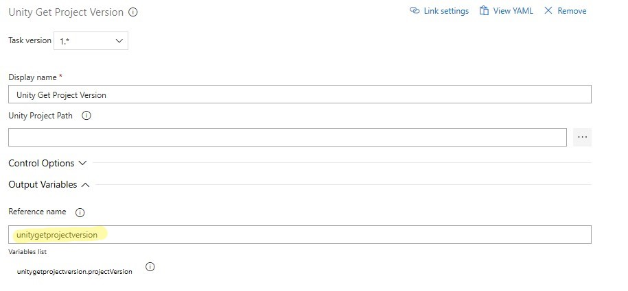
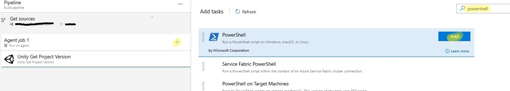
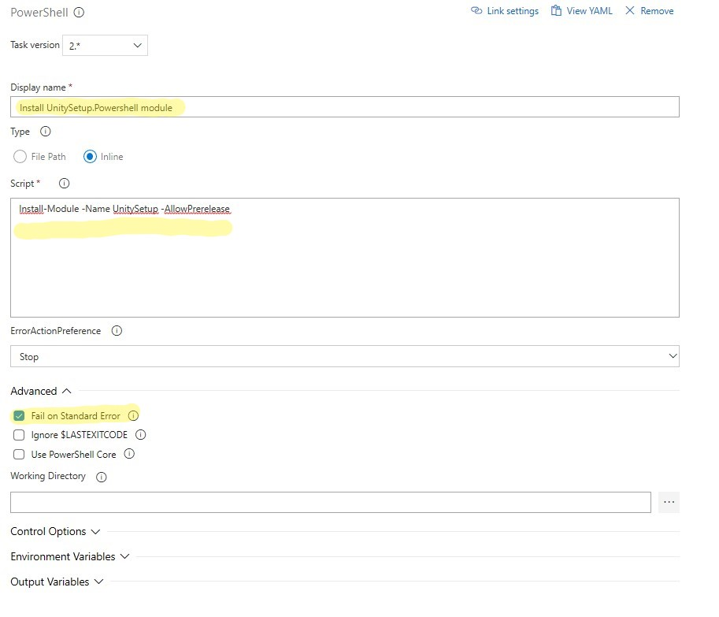
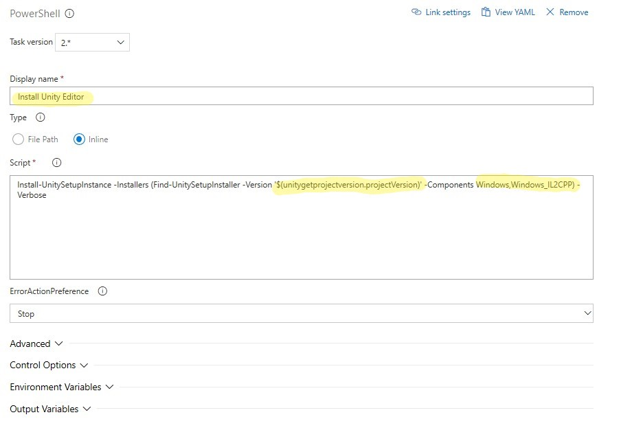

## Build a Unity project using a Microsoft hosted agent

The process for building on a hosted agent is basically the same as with custom agents. There is only one thing we need to keep in mind: The Unity version required by our project might not be installed on the agent. You can always check out the software and tools intalled on hosted agents [here](https://github.com/Microsoft/azure-pipelines-image-generation#image-contents). Let's get started.

### Create a new build pipeline

Open your Azure DevOps project and navigate to the Pipelines module. Then select **New -> New Build Pipeline**. In the first step you need to tell the pipeline where to get source code for your Unity project. Please complete this step according to your needs. For this example I am using source code hosted on Azure Repos.

Next we need to select a template for the build pipeline. If you have experience you might select one of the existing templates and build on top of it. For this example we'll use the empty template to start from scratch. Search in the search box for "empty" and select the **Empty pipeline** template.

Alright, we now have a new empty pipeline. Please enter a name for your build pipeline (I named it "Unity Build Pipeline Hosted Agent" for this example). Also select the agent pools to use. I am going to use **Hosted VS2017** here.

### Add tasks to the pipeline

The first task we want to add when building on a hosted agent is the [Unity Get Project Version](unity-get-project-version.md) task. This task will help us to find out which Unity version we need to install for our project to build. Select the + - Button on the **Agent job 1** in your pipeline and search for "Unity". Then add the task to the pipeline.

This task does not have many options. The Unity Project path is optional. If your Unity project's Asset folder is not in the repository root, please specify the path to the Unity project here. For this example we'll leave it empty (repository root). Make sure to unfold the **Output Variables** options and specify a reference name for the task, because we will need it to get a reference to the projectVersion output variable.

Alright. Next we'll need to install a PowerShell module which will help us to install the required Unity version on build. Please select the + - Button on the agent job again, search for "PowerShell" and add the **PowerShell** task to the pipeline.

Select it for editing and enter the name "Install UnitySetup.PowerShell module". We make use of [this open source module](https://github.com/Microsoft/unitysetup.powershell) here to install Unity, so we need to install it first on the agent. Make it an **Inline** type script and paste `Install-Module -Name UnitySetup -AllowPrerelease` into the script field. Also make sure to check "Fail on Standard Error" in the advanced options. At the time of writing this, a prerelease version of this module is needed since it contains a fix we need.

Great. Now repeat this and add another PowerShell task to the pipeline. This one will actually install Unity. Give it the name "Install Unity Editor" therefore. Again make it an **Inline** type script and paste `Install-UnitySetupInstance -Installers (Find-UnitySetupInstaller -Version '$(unitygetprojectversion.projectVersion)' -Components Windows,Windows_IL2CPP) -Verbose` into the script field. Note how we are using the output variable of the Get Project Version task to tell it which version to install. For this example we are building a standalone player on a Windows agent so we need the Windows and Windows_IL2CPP Unity modules to be installed. Please check the modules documentation for all the module specifiers you can put here.

