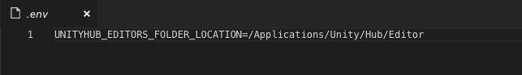

Please follow the official documentation on how to ["Deploy an agent on macOS"](https://docs.microsoft.com/en-us/azure/devops/pipelines/agents/v2-osx?view=vsts) for use in your Azure DevOps organization. Once you have done that, please navigate the Finder to the agent's root directory. Use `COMMAND + SHIFT + .` to show hidden files in the folder. Check whether a `.env` file already exists. If not, please create one.

Once you have the file in place, open it for editing in a text editor and add the environment variable `UNITYHUB_EDITORS_FOLDER_LOCATION` to it and set the value to the path where all your editors can be found.

Now that you have configured the agent's environment variables as needed for the Unity build task to work, you can start the agent. Open a Terminal window and navigate to the agent's root directory. Now exectute the following command:

`./svc.sh stop`

If you get a message `*.plist: No such file or directory`, please execute the following:

`./svc.sh install`

This will install the agent as a service on the agent. Next run:

`./svc.sh start`

to run the agent. If your agent was already running, make sure to restart it properly for the change to take effect. Open your Azure DevOps organization in a browser of your choice and in the `Organization settings` under `Agent pools` select your agent pool and find the right agent. Verify it's online and under capabilities verify it has the Unity editors folder location environment variable set.

Congratulations! Your agent is now ready to build Unity projects.
